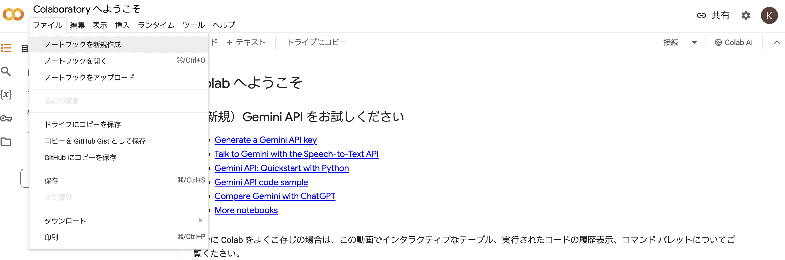
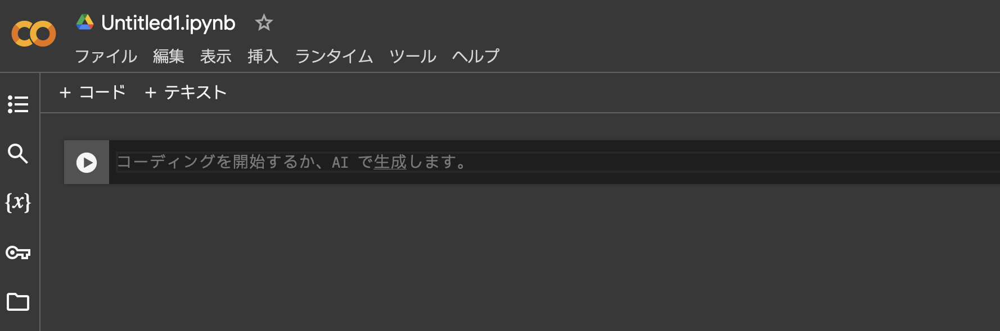
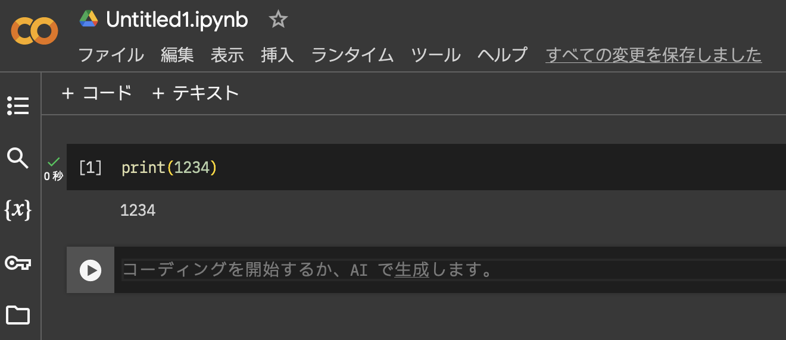

### Google Colaboratory使い方
#### 1. Google Colaboratoryとは
- Google Colaboratoryは，Googleが提供するクラウドベースのJupyterノートブックを実行できる環境です．
- Google ColaboratoryはGoogle Driveと連携しており，ノートブックの保存や共有が容易です．
- Google Drive上に保存されたデータセットやファイルにアクセスできます．

※ネット環境があれば，いつでも誰でも何処でも利用可能です．

#### 2. 利用方法
- Google Colaboratoryを利用するには， Googleアカウントにログインした状態で，[公式サイト](https://colab.research.google.com/)にアクセスする．

- アクセスすると，トップページが表示されるので，左上にある新規のノートブックを作成する．

- 「ファイル」->「ノートブックの新規作成」をクリックすることで，新規のノートブックが作成されます．
- ノートブックは ログインしているGoogleアカウントのGoogle Driveに保存されます．



- ノートブックはのセルにプログラムを書き込むことでプログラムを実行できる．



- プログラムを書き込んだ後，「Shiftキー」を押しながら，「Enterキー」を押すとプログラムを実行できる．



- 人気の高い外部ライブラリは既にインストールされています．
  -  ```numpy```, ```matplotlib```, ```pandas```, など 
- 追加のライブラリのインストールも非常に簡単に行えます
  - ゼミナール中で適宜指示します